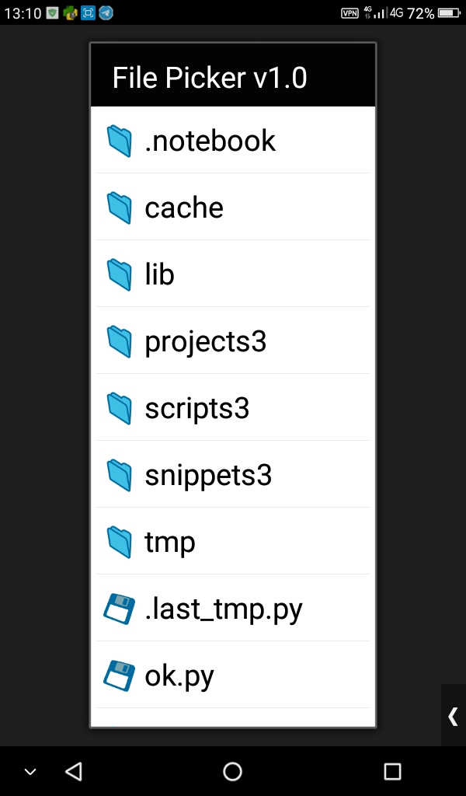
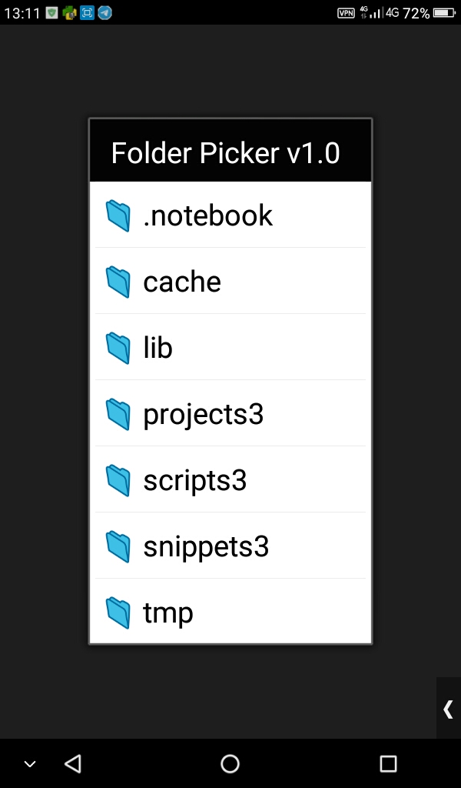
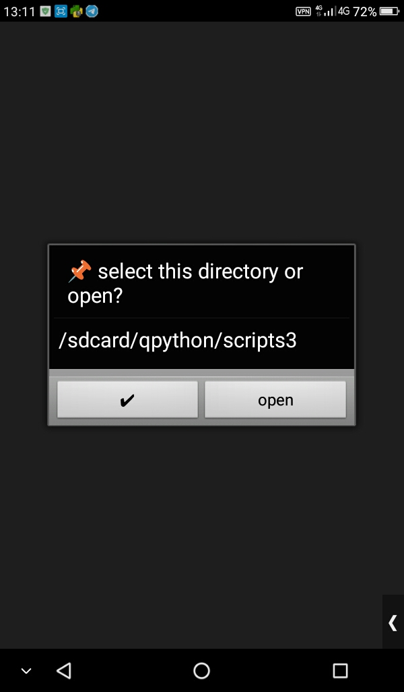

PICKUI is advance file and folder picker for qpython, [inspired](https://stackoverflow.com/questions/37795626/file-dialog-in-python-sl4a).

### Installation

```
pip install https://github.com/guangrei/pickui/archive/main.zip
```

### Example 

```python
from pickui import PickUI

"""
base_dir: base directory path, default /storage.
private: ignore private file, directory and respect .nomedia,  default  False.
"""

p = PickUI(private=True)
p.set_title("my app")
file = p.filePicker()
print(file)
folder = p.folderPicker()
print(folder)
# file picker with extension filter
ext = (".jpg",".png",".gif",".jpeg",)
file2 = p.filePicker(filter=ext)
print(file2)
```

## Screenshot





